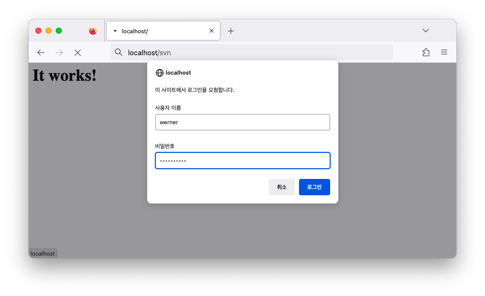
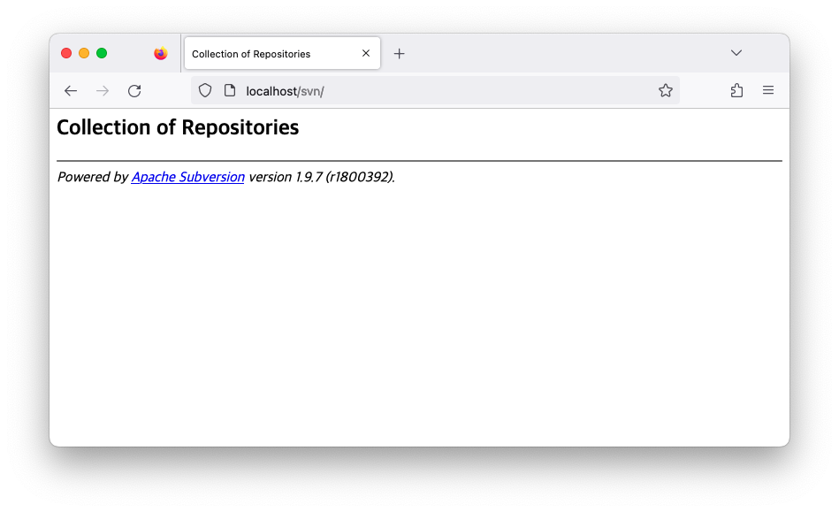

# Apache Subversion

- [subversion.apache.org](https://subversion.apache.org/)
  - [docs](https://subversion.apache.org/docs/)
  - [packages](https://subversion.apache.org/packages.html)
- [book](https://svnbook.red-bean.com/)

## Start

### Run SVN Server

- github: [elleFlorio/svn-docker](https://github.com/elleFlorio/svn-docker)
- [docker-compose.yml](docker-compose.yml)

```bash
docker compose up -d
```

### Access WebDav

```bash
# docker compose exec -it svn htpasswd -b /etc/subversion/passwd <username> <password>
docker compose exec -it svn htpasswd -b /etc/subversion/passwd werner heisenberg
```

output:

```bash
Adding password for user werner
```

- Open: [http://localhost](http://localhost)
- Open: [http://localhost/svn](http://localhost/svn)
- Open: [http://localhost/svnadmin](http://localhost/svnadmin)




### Install Client

#### macOS

macports: [subversion](https://ports.macports.org/port/subversion/)

```bash
sudo port install subversion
```
